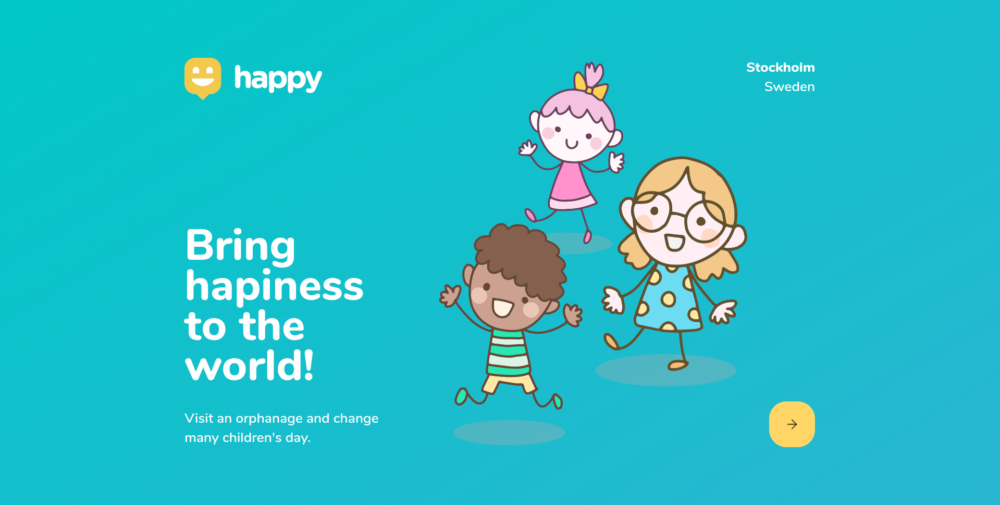
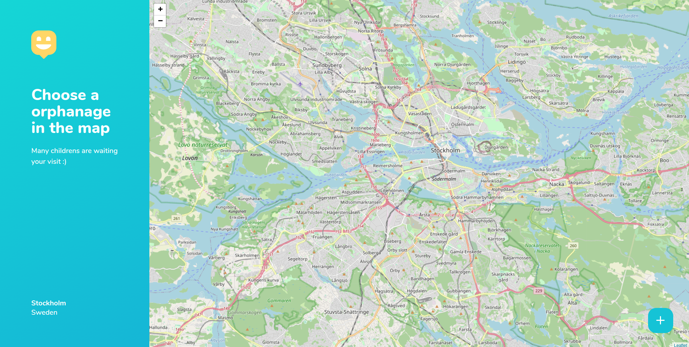
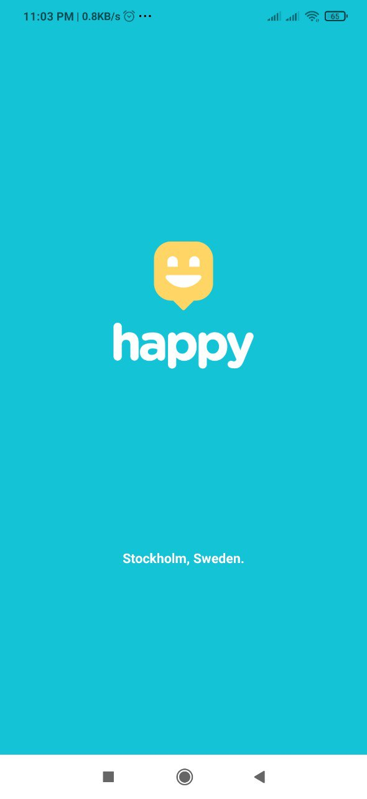
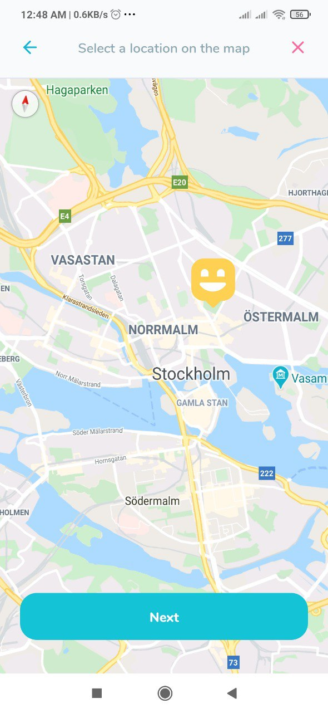

# Happy Application - Bring happiness to the world!

<h1 align="center">
  
  <br />
  <a href="https://github.com/billiemoreira/nlw3-happy">
    
  </a>
  <a href="https://github.com/billiemoreira/nlw3-happy/stargazers">
    
  </a>
 
</h1>

<p align="center">
  <a href="#about">About</a>&nbsp;&nbsp;&nbsp;|&nbsp;&nbsp;&nbsp;
  <a href="#technologies">Technologies</a>&nbsp;&nbsp;&nbsp;|&nbsp;&nbsp;&nbsp;
  <a href="#functionalities">Functionalities</a>&nbsp;&nbsp;&nbsp;|&nbsp;&nbsp;&nbsp;
  <a href="#links">Live versions</a>&nbsp;&nbsp;&nbsp;|&nbsp;&nbsp;&nbsp;
  <a href="#clone-this-repository">Clone this repository</a>
</p>

<br>
<h1 align= "center">


</h1>

<h1 align="center"> 



</h1>

## About

An web and mobile application where the user can register orphanages or look for one to visit. It has features such as registration, search on maps and updating. This is a project of the third edition of the [Rocketseat](https://github.com/Rocketseat) Next Level Week event made with ReactJS and React Native.


## Technologies

- [React.js](https://pt-br.reactjs.org/)
- [React Native](https://reactnative.dev/)
- [TypeScript](https://www.typescriptlang.org/)
- [Node.js](https://nodejs.org/en/)
- [Expo](https://expo.io/)
- [Postgresql](https://www.postgresql.org/)
- [StyledComponents](https://styled-components.com/)
- [TypeORM](https://typeorm.io/#/)


## Functionalities

- Register a new orphanage
- View all orphanages registered.
- See details of each orphanage.


## Links

In the following links you will find the versions in UI Design Web and Mobile

- [Layout Web](https://www.figma.com/file/mDEbnoojksG4w8sOxmudh3/Happy-Web?node-id=0%3A1)
- [Layout Mobile](https://www.figma.com/file/X27FfVxAgy9f5IFa7ONlph/Happy-Mobile?node-id=0%3A1)

## Clone this repository

```js
$ git clone https://github.com/billiemoreira/nlw3-happy.git

# enter the project folder

$ cd nlw3-happy

$ yarn install

$ yarn start